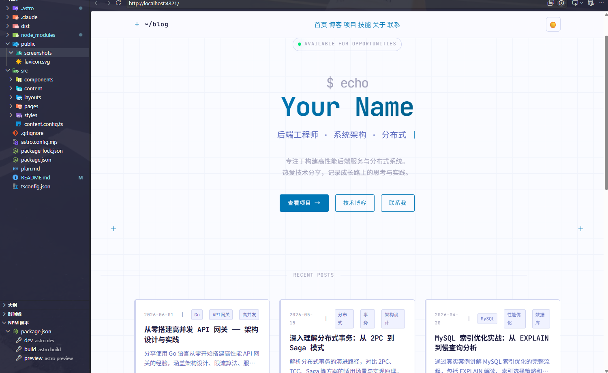
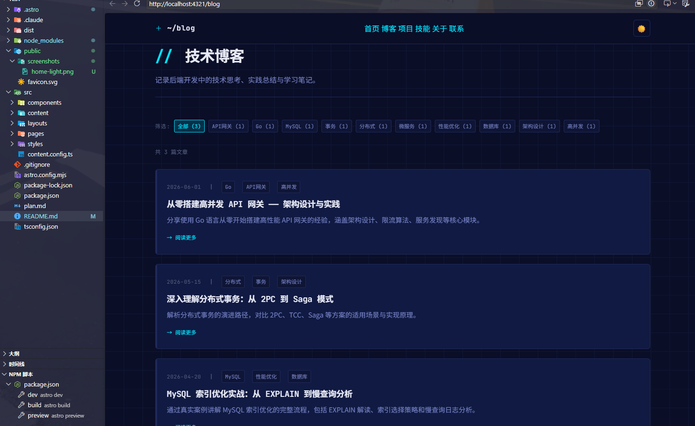
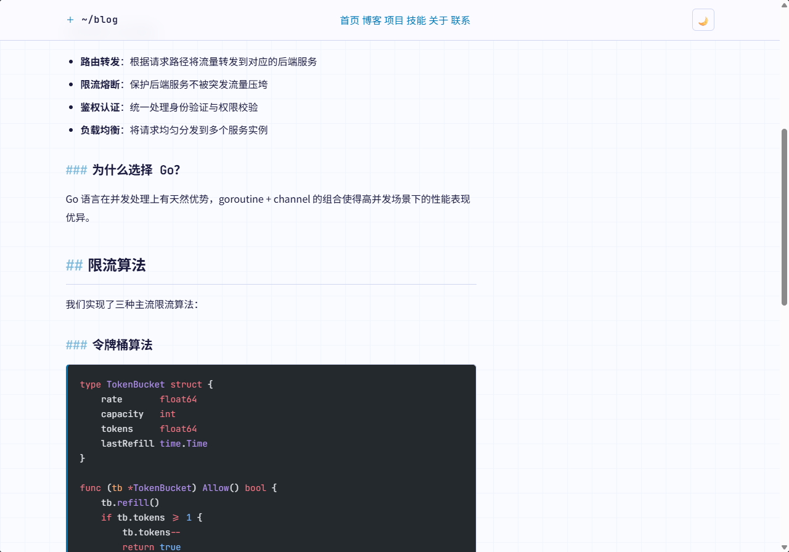
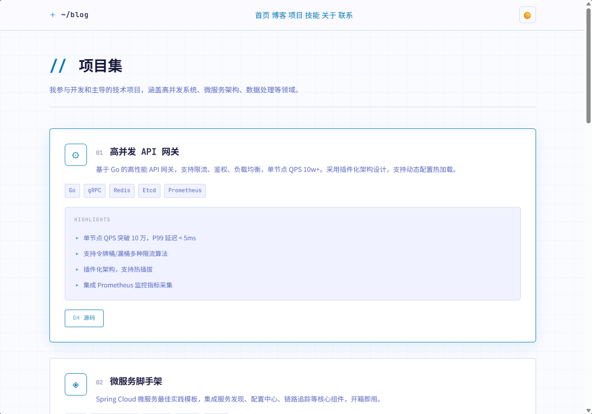
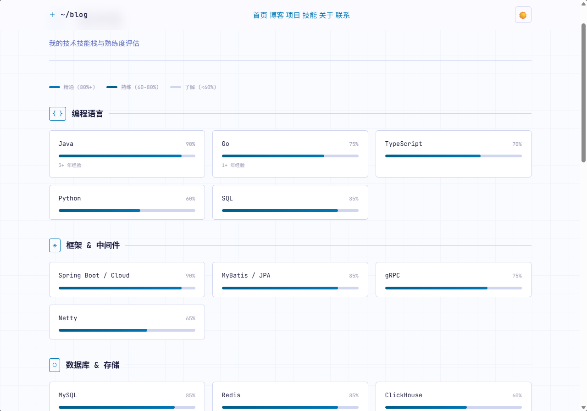
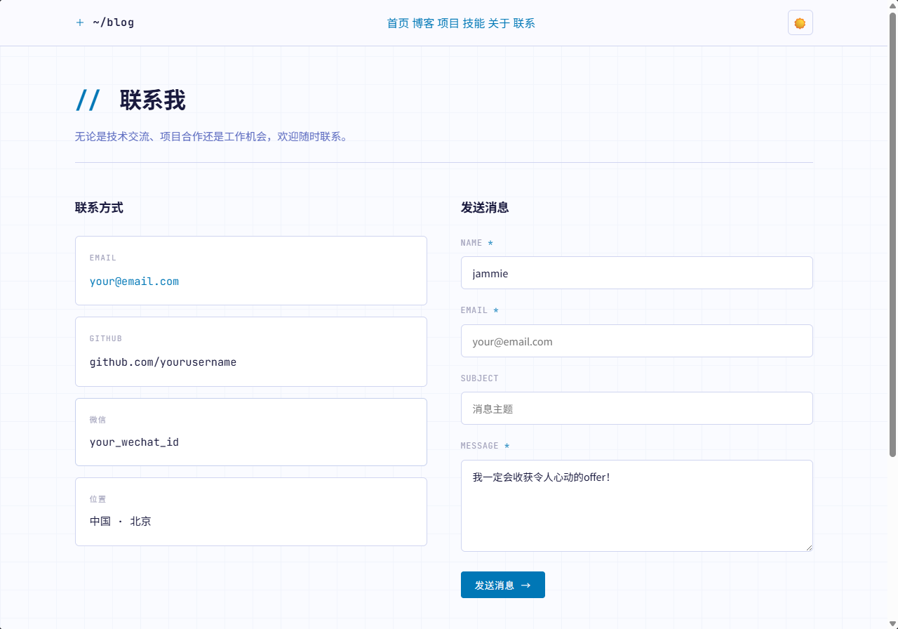

# LZM 的个人博客

> 后端开发求职 · 技术博客 · 项目展示

基于 **Astro** 构建的个人技术博客，采用 Blueprint（蓝图）视觉风格——深色主题搭配工程网格背景，展示后端开发经验、项目实践与技术思考。面向技术面试官、HR 和技术同行。

## 效果预览

### 首页（浅色）


### 博客列表


### 文章详情


### 项目展示


### 技术栈


### 联系我


## 技术栈

| 层面 | 技术 | 版本 |
|------|------|------|
| 框架 | [Astro](https://astro.build/) | v6 |
| 样式 | Tailwind CSS (utility-first) | — |
| 内容 | Markdown / MDX | `@astrojs/mdx` |
| 字体 | JetBrains Mono + Noto Sans SC | Google Fonts |
| 部署 | Vercel | — |

## 页面路由

| 路由 | 说明 |
|------|------|
| `/` | 首页 · 自我介绍 + 快速入口 |
| `/blog` | 技术文章列表（标签筛选） |
| `/blog/:slug` | 文章详情（Markdown 渲染） |
| `/projects` | 项目展示 · 卡片网格 |
| `/skills` | 技能栈 · 可视化标签 |
| `/about` | 关于我 · 详细自我介绍 |
| `/contact` | 联系方式 · GitHub / 邮箱 |

## 快速开始

```bash
# 安装依赖
npm install

# 本地开发（热更新）
npm run dev
# → http://localhost:4321/

# 构建静态站点
npm run build
# → 产物输出至 dist/

# 本地预览构建结果
npm run preview
```

## 项目结构

```
src/
├── content.config.ts              # 内容集合定义（schema）
├── content/blog/                  # 博客文章（.md / .mdx）
│   ├── api-gateway-design.md
│   ├── distributed-transactions.md
│   └── mysql-index-optimization.md
├── layouts/
│   ├── BaseLayout.astro           # 全局布局（Nav + Footer + 主题切换）
│   └── BlogPostLayout.astro       # 文章详情页布局
├── components/
│   ├── Nav.astro                  # 导航栏
│   ├── Footer.astro               # 页脚
│   ├── Card.astro                 # 通用卡片
│   └── Tag.astro                  # 标签组件
├── pages/
│   ├── index.astro                # 首页
│   ├── about.astro                # 关于
│   ├── projects.astro             # 项目展示
│   ├── skills.astro               # 技能栈
│   ├── contact.astro              # 联系方式
│   └── blog/
│       ├── index.astro            # 文章列表
│       └── [slug].astro           # 文章详情（路由捕获）
└── styles/global.css              # 全局样式（Blueprint 设计系统）
```

## 设计系统

本项目内置一套 **Blueprint** 设计语言，核心 Token 如下：

| Token | 深色主题 | 浅色主题 | 用途 |
|-------|---------|---------|------|
| `--bg` | `#0a0e27` | `#fafbff` | 页面背景 |
| `--bg-card` | `#111a42` | `#ffffff` | 卡片背景 |
| `--accent` | `#00e5ff` | `#0077b6` | 强调色 |
| `--text` | `#e8eaf6` | `#1a1a3e` | 主文本 |
| `--text-dim` | `#7986cb` | `#5c6bc0` | 次要文本 |
| `--border` | `#1e2a5a` | `#d0d5f0` | 边框 |

### 特性

- **暗色/浅色模式** — 自动检测系统偏好，支持手动切换（`localStorage` 持久化）
- **网格背景** — Blueprint 风格的工程图纸网格线（双层尺寸 200px / 40px）
- **响应式** — 移动端导航栏折叠 + 弹性间距
- **文章排版** — 自定义 `prose` 类，代码块带左侧强调线，标题前缀 `##` / `###` 装饰
- **动画** — 淡入上移（fade-in-up）、光标闪烁（cursor-blink）、光晕脉冲（pulse-glow）

## 编辑博客

### 写一篇文章

1. 在 `src/content/blog/` 下新建一个 `.md` 文件，例如 `my-new-post.md`
2. 在文件顶部写入 frontmatter 元数据：

```yaml
---
title: '文章标题'
description: '文章简介，会出现在列表页和 SEO 描述中'
pubDate: 2026-06-12
updatedDate: 2026-06-15          # 可选，修改时更新
tags: ['Astro', '博客', '教程']  # 可选
draft: false                     # 设为 true 则不发布
---
```

3. 之后用 Markdown 语法撰写正文即可，支持内嵌 HTML
4. 添加 MDX 支持后，还可以在文章中内嵌 React 组件

### 修改页面内容

所有页面都在 `src/pages/` 下，直接编辑对应的 `.astro` 文件即可：

| 文件 | 编辑内容 |
|------|---------|
| [index.astro](src/pages/index.astro) | 首页自我介绍、头像、快速入口 |
| [projects.astro](src/pages/projects.astro) | 项目数据数组（名称、描述、技术栈、链接） |
| [skills.astro](src/pages/skills.astro) | 技能分类和熟练度 |
| [about.astro](src/pages/about.astro) | 详细自我介绍、简历 PDF 路径 |
| [contact.astro](src/pages/contact.astro) | GitHub / 邮箱 / 社交链接 |

### 修改样式

| 文件 | 作用 |
|------|------|
| [global.css](src/styles/global.css) | 设计 Token、配色、排版、动画 |
| 各组件 `.astro` 文件 | 页面级别的 Tailwind 类名 |

### 站点级配置

编辑 [astro.config.mjs](astro.config.mjs)：

```js
export default defineConfig({
  site: 'https://your-site.vercel.app',  // ← 替换为你的域名
  integrations: [mdx()],                 // ← 按需增删集成
});
```

### 内容 Schema

博客集合的字段定义在 [content.config.ts](src/content.config.ts)，支持字段：

| 字段 | 类型 | 必填 | 说明 |
|------|------|------|------|
| `title` | string | ✅ | 文章标题 |
| `description` | string | ✅ | 文章描述 |
| `pubDate` | date | ✅ | 发布日期 |
| `updatedDate` | date | ❌ | 最后更新时间 |
| `tags` | string[] | ❌ | 标签数组 |
| `draft` | boolean | ❌ | 是否草稿（默认 false） |

## 部署到公网

### 方式一：Vercel（推荐）

Vercel 绑定 GitHub 仓库，push 代码即自动部署，免费额度足够个人使用。

**1. 推送代码到 GitHub**

```bash
git init
git add .
git commit -m "Initial commit"

# 在 GitHub 创建仓库后执行
git remote add origin https://github.com/YOUR_USERNAME/your-repo.git
git push -u origin main
```

**2. 在 Vercel 上导入项目**

- 访问 https://vercel.com ，用 GitHub 登录
- 点击 **Add New Project**，选择刚推送的仓库，点击 **Import**
- 项目设置确认：
  - **Framework Preset**: `Astro`
  - **Build Command**: `npm run build`
  - **Output Directory**: `dist`
  - **Install Command**: `npm install`
- 点击 **Deploy**，约 1-2 分钟即可上线

**3. 配置站点地址**

部署完成后，将 [astro.config.mjs](astro.config.mjs) 中的 `site` 替换为你的 Vercel 域名：

```js
export default defineConfig({
  site: 'https://your-project.vercel.app',  // ← 替换为实际域名
  // ...
});
```

> 每次 push 到 GitHub，Vercel 都会自动触发重新构建并更新线上版本。

### 方式二：其他静态托管平台

构建产物在 `dist/` 目录下，也可以部署到：

| 平台 | 说明 |
|------|------|
| [Cloudflare Pages](https://pages.cloudflare.com/) | 全球 CDN 速度快，免费额度充足 |
| [GitHub Pages](https://pages.github.com/) | 使用 `github.io` 域名，免费 |
| [Netlify](https://www.netlify.com/) | 拖拽 `dist/` 目录即可部署 |

部署时只需指定构建命令 `npm run build` 和输出目录 `dist` 即可。
